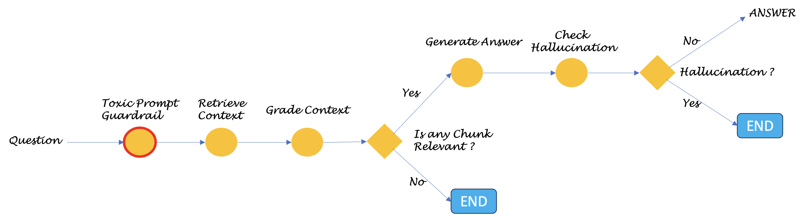

# agentic_rag

### Introduction
This is a self-correcting RAG pattern that checks the retrieved contexts for relevancy and the generated answers for hallucinations.\
It is loosely based on this Self-RAG [paper](https://arxiv.org/abs/2310.11511)\
\
The LLM used in this is llama3:8b. The embedding model used is mxbai-embed-large (dim is 1024). Both are ran locally using ollama

There is an experimental implementation of guardrails functionality. A opinionated take is that checking the incoming prompts for toxicity or the domain fit is a classification problem. While LLMs can be used for classifying toxicity, this approach might not work reliable for scenarios that need filtering non-toxic incoming questions that do not fit into the intended domain. For example, fitering out questions based on competitors or out-of-bound subject areas. When there is a greater control needed, there are colorful choices of classic algorithms like RandomForest classification. When used with embeddings as the features, they are expected to perform better than ever. So, here is an experimental implementation presented in toxic_rail_experiment.ipynb\

To try this out:\
    a) Install ollama\
    b) Pull llama3 and mxbai-embed-large models locally (ollama pull...)\
    c) step through toxic_rail_experiment.ipynb where randomforest classifier model will be created. The dataset used for this experiment was taken from this [kaggle dataset](https://www.kaggle.com/c/jigsaw-toxic-comment-classification-challenge/data) \
    d) Step through the the agentic_rag_index notebook to create the vectorstore and index.\
    e) Step through the agentic_rag_generate notebook to run the workflow that the runs the steps as in the graph above.
